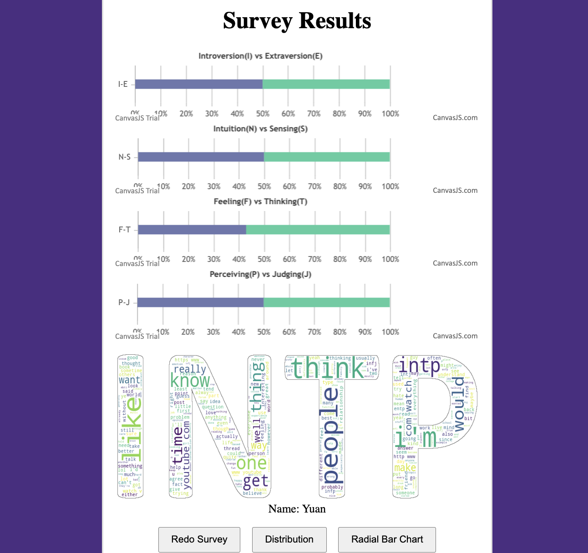
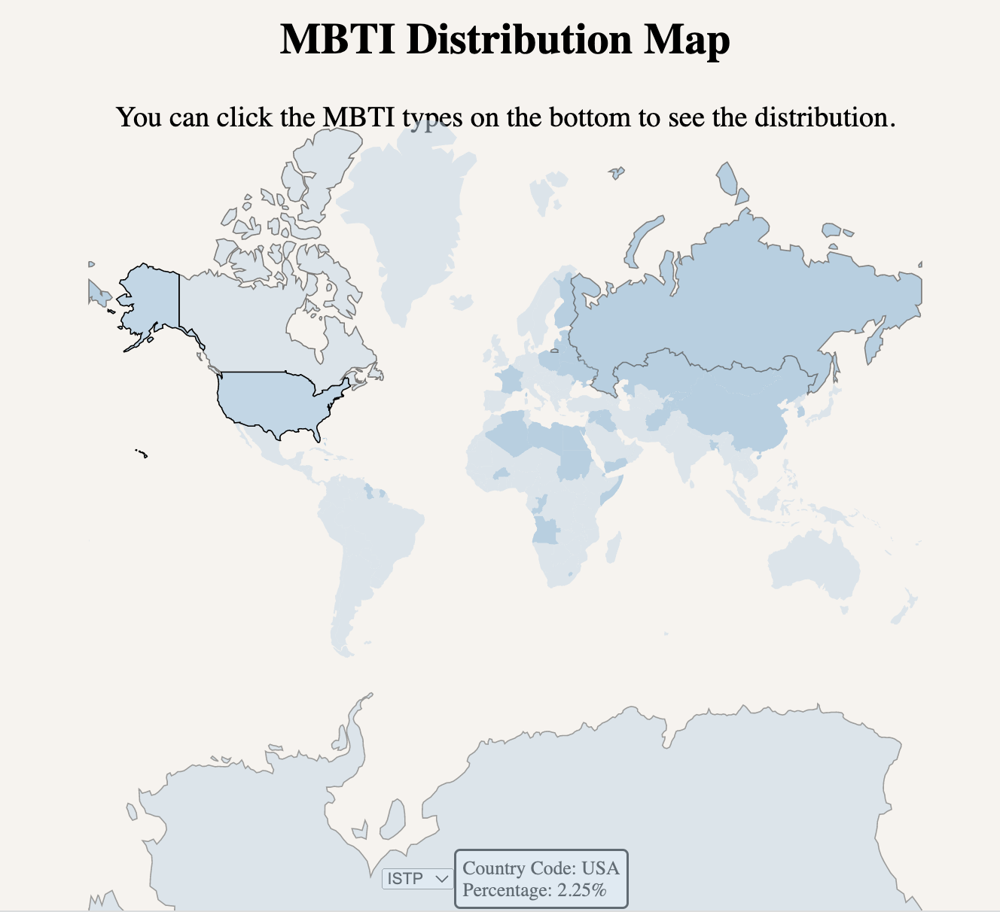

# Project name: A Journey to Understand Yourself with MBTI
MBTI large dataset: https://www.kaggle.com/datasets/zeyadkhalid/mbti-personality-types-500-dataset \
Country wise MBTI personality dataset: https://www.kaggle.com/code/rajjain/country-wise-mbti-personality

## Team members:
* Kuan-Ting Yeh
* Xuchong Du
* Ziyuan Wang
* Zhenman Yuan
## Goals:
We all live in a fast-paced society; people can access the internet to gain much information and knowledge about other people or things they want to learn. However, it is shockingly brutal to understand something about yourself, and most people are unaware of that. The Myers-Briggs Type Indicator (MBTI) is a personality assessment tool that targets a broad audience who wishes to learn to understand themselves more. However, users will need around 30 minutes to complete the MBTI, which could be more efficient in this fast-paced society. Our goal is to create an interactive platform through an online survey with some distinct keywords from different MBTI categories. Then, we will analyze those words by statistical data to predict the user's personality and finally pop up the result with a colorful Word Cloud figure that links those keywords to the user's MBTI. We will also display a comparison chart to let users select their preferences while comparing. Moreover, we will display a radar chart of MBTI personalities that are similar to the user's MBTI with some related famous people at the bottom instead of a lengthy report. This project that we build would be beneficial in the following categories of groups of people:

* Self-improving: People who want to know their strengths, weaknesses, thinking style, and communication style could quickly use their MBTI WordCloud results to understand themselves.
* Relationship: People eager to solidify relationships or friendships could use the comparison charts to understand the differences between different personality types along with the MBTI WordCloud.
* Teamwork: People who wish to use IMBT results to quickly find suitable teammates or coworkers could use the radar chart to navigate and explore good matches while working on a project.
* Career paths: People exploring potential career paths that align with their personality type and preferences could also check out the successful people list at the bottom to have more ideas about their future career opportunities.

## Visualizations and Interactive Tools:
  * MBTI Word Clouds
  * E-I/N-S/T-F/J-P Comparison 
  * Radial Stack Bar-Charts
  * Percentage Horizontal Stack Bar-Charts

## Example and User Instruction: 
Welcome to our user-friendly app! Upon opening the app, you'll be greeted by a visually appealing interface featuring a soothing purple background for the MBTI survey.

To begin, simply enter your name and proceed by clicking the "Next" button. You'll then be presented with a captivating Word Cloud that relates to the "E(Extraversion)-I(Introversion)" test. Take your time to select the words that resonate with you by simply clicking on them.

Next, you'll go through a similar word-picking process for the "N(Intuition)-S(Sensing)", "T(Thinking)-F(Feeling)", and "J(Judging)-P(Perceiving)" tests. 

Once you've completed all the steps and submitted your results, you'll be able to view your unique MBTI personality type. This will include detailed information about the proportion of each type (E-I, N-S, T-F, J-P) and personalized word clouds that reflect your personality type.

For those interested in exploring further, you can click on "Distribution" to discover the global distribution of your personality type across different countries. This feature provides fascinating insights into how your personality compares on a global scale.

Additionally, by selecting "Radial Bar Chart," you'll gain access to an informative display showcasing the top 10 most frequent words associated with each of the 16 personality types. This valuable knowledge allows you to delve deeper into the characteristics and traits associated with each type.

We hope you enjoy your journey of self-discovery through our app. Get ready to uncover fascinating insights about yourself and explore the fascinating world of MBTI!!! 

## Principle for Word Cloud Generation: 
To generate the word cloud for testing each of the four indicators, we conduct an analysis using the dataset MBTI_500.csv. During this process, we meticulously record the count and frequency of each word. Let's take the word "like" as an example. We document its frequency across each indicator as follows: {'I': 530,221, 'E': 167,945, 'S': 61,394, 'N': 636,772, 'T': 432,225, 'F': 265,941, 'J': 284,151, 'P': 414,015}.

Next, we calculate the ratios of "I"/"E", "E"/"I", "S"/"N", "N"/"S", "T"/"F", "F"/"T", "J"/"P", and "P"/"J". Upon analysis, we discover that the ratio of "N"/"S" is the highest. As a result, the word "like" is classified into the word group for "N words for Comparison between N-S". With this classification in mind, we proceed to form eight distinct word groups.

Within each group, we carefully select 20 words based on their respective highest ratio values. This meticulous process ensures the creation of a meaningful and informative word cloud.

## Data, Images, and Document: 
Topic Selection (20 hours): Ziyuan Wang, Zhenman Yuan, Xuchong Du, Kuan-Ting Yeh.\
Data Collection (30 hours for each): Ziyuan Wang, Zhenman Yuan, Xuchong Du, Kuan-Ting Yeh.\
Data Cleaning (10 hours for each): Ziyuan Wang, Zhenman Yuan, Xuchong Du.\
Javascript, D3 Programming (20 hours for each): 
MBTI Wordcloud Images creating (5 hours for each): Xuchong Du, Kuan-Ting Yeh\
Readme document (6 hours): Kuan-Ting Yeh 

## Interactive Visualization:
The most chellanging step in this project was the interactive visualization, as our team members were not familiar with the D3 packages and had to learn about html, CSS, and Javescript before using them as well. 
1.	Survey platform, clickable words on WordCloud, and percentage horizontal stack bar-chart of matching words (25 hours): Kuan-Ting Yeh
2.	MBTI world map, hover feachures on the map, and MBTI dropdown features (20 hours): Ziyuan Wang
3. Radial Stacked Bar Chart, percentage horizontal stack bar-chart and the hover feachures on the chart (25 hours): Zhenman Yuan 

## Acknowledgement 
We would like to thank to ChatGPT for the support and writing polishing. 

